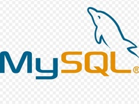

# Hi there, I'm Nayan Jyoti Sharma! 👋

 <!-- Replace with your custom banner image URL -->

---

## 👨‍💻 About Me

- **Business Analyst & Strategist** with expertise in data analysis, decision-making, and creative problem-solving.
- 📊 Skilled in **MS Excel**, **Power BI**, **MySQL**, and **Python** for data-driven insights and strategies.
- 🤝 Passionate about empowering businesses to thrive with innovative solutions and strategies.
- 🌱 Currently expanding my knowledge in **AI**, **Data Science**, and **advanced analytics**.
- 🚀 Always eager to collaborate and contribute to impactful projects.

---

## 💻 Technologies & Tools

## 🚀 Projects

### 📊 Data Analytics Projects
- **[Store Annual Data Analysis](https://1drv.ms/x/c/b770a6cd097714de/Ef8beWnr2bhPvDILAYLBDtEBMV-Q1dWIr0Y5B9i6dAOj9Q?e=zzkfMY)**: An analysis project using **Excel** Analyse Data of past 3 year to find insight to make future decisions. After data-cleaning and analysing created a dashboard for the Data Virtualization.
- **[Sales Data Analysis](https://1drv.ms/x/c/b770a6cd097714de/ESA1_N8ZM_lIs_6XU77so1wB3lAGXm7eI76e7DyFrGQi-g?e=jxV91u)**: Created a **Excel** Dashboard Analysing the Data of a industries showing the top category of sales and top customers. The dashboard gives a insight of profit gained over time with customer distribution with respect to the area.
- **[HR Analytics Dashboard](https://www.linkedin.com/posts/nayanxs_powerbi-hranalytics-datadriven-activity-7264073036683755520-0RIU?utm_source=share&utm_medium=member_desktop)**: Developed an HR Analytics dashboard using **Power BI** to help an organization reducing attrition rates.
 Identified key performance indicators (KPIs) to track employee engagement, satisfaction, age, and
 turnover rates.
 
### 🌟 Featured Contributions
- **[Business Strategy for a Food Chain Startup](#)**: Developed a comprehensive strategy for a growing local food chain startup, focusing on scalability and consistent brand image across multiple locations.  Conducted competitor analysis to identify gaps in the local food market, offering insights for
 differentiation and unique selling points.
- **[Data Analysis for the Local Restaurants and Cafes](#)**: Crafted data-driven business strategies for local restaurants, cafes, startups, and hospitals, leading to a
 revenue increase.
  Analysed data from Pet Pooja billing app to identify food-fall time and create strategies based on it .
  Managed the team to look after the clients and the fluent work flow.

---

## 📫 Let's Connect

---

*Let's collaborate and make great things happen!*
